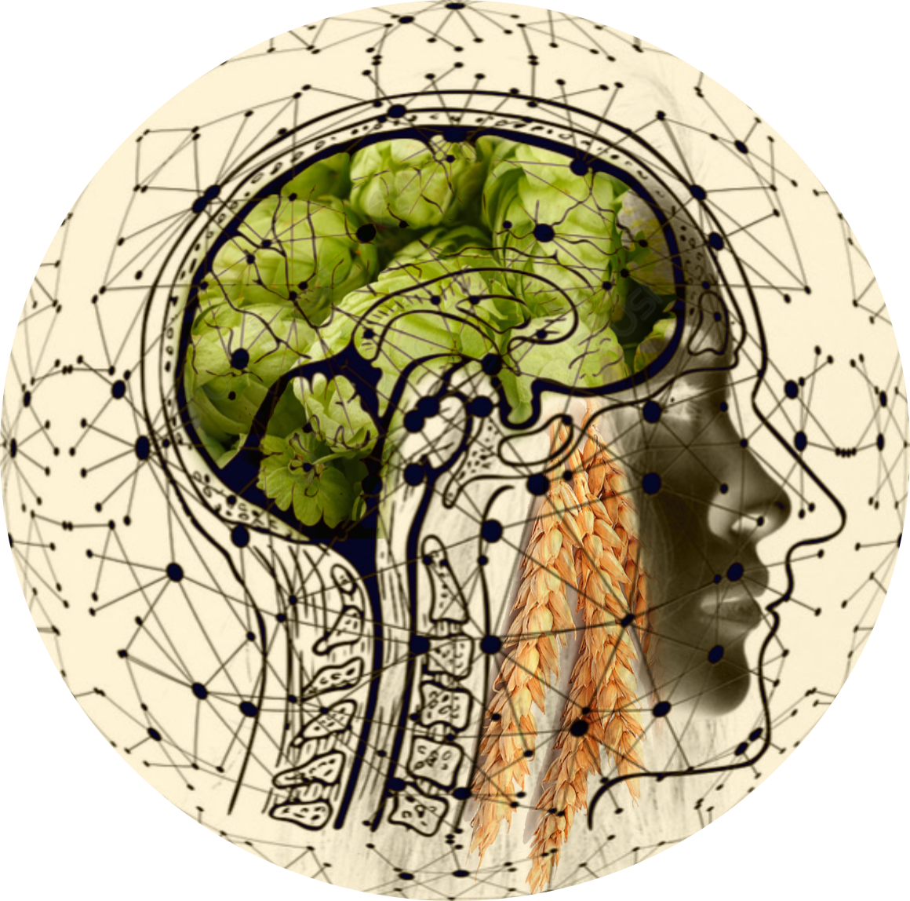

# BirrAI
<div align="center">
  
</div>
La produzione di birra artigianale ha una storia millenaria, ed è considerata uno dei processi più antichi al mondo. Nel corso dei secoli, le ricette e le conoscenze sono state tramandate, mentre la birra e i suoi processi di produzione sono stati oggetto di studio da parte di matematici, scienziati e chimici, portando a un continuo sviluppo e miglioramento.

In contemporanea, i progressi nell’intelligenza artificiale (AI) hanno aperto nuove prospettive e opportunità per l’innovazione nelle ricette di birra e per il monitoraggio e il miglioramento dei processi produttivi e della qualità del prodotto finale.

L’obiettivo principale di questa ricerca è stato sviluppare algoritmi di intelligenza artificiale per la generazione di nuove ricette di birra artigianale e per la predizione dell’attributo chimico IBU (International Bitterness Units). Sono state esplorate diverse metodologie, tra cui algoritmi genetici (GA), clustering con K-means, raccomandazioni basate sugli item e metodi basati su regole, oltre all’implementazione di Random Forest per la predizione dei valori di IBU.

In particolare, l’approccio basato su GA è risultato efficace nell’esplorazione del panorama delle ricette e nell’identificazione di combinazioni di ingredienti non convenzionali, mentre l’uso di K-means e raccomandazioni basate sugli item ha agevolato il raggruppamento delle ricette in base a caratteristiche simili, favorendo la scoperta di nuove combinazioni. Nel contesto della previsione dei valori di IBU, l’approccio con Random Forest ha dimostrato un’accuratezza promettente, consentendo un maggiore controllo sul sapore amaro nelle birre.

Questo progetto ha contribuito all’intersezione tra l’arte antica della produzione di birra artigianale e le moderne tecnologie dell’intelligenza artificiale, aprendo nuove vie per l’innovazione e l’esplorazione nel mondo della birra. L’applicazione di algoritmi AI per la generazione di ricette e la previsione degli attributi chimici promette di influenzare positivamente la creatività dei birrai e la qualità delle birre prodotte.

## Descrizione
Questo progetto consiste in tre cartelle contenenti diversi moduli per la normalizzazione del dataset di partenza e per la scrittura di algoritmi di diversa natura per creare nuove ricette di birra.

## Struttura delle Cartelle
Il progetto è strutturato nel seguente modo:

1. `algoritmi`:
   - `rules_based.py`: questo modulo implementa l'applicazione di regole specifiche per combinare gli ingredienti, in base alle caratteristiche della categoria di birra desiderata.
   - `item-based-recommendation.py`: questo modulo, dato l'ID di una ricetta nel database, calcola le ricette più simili in base agli ingredienti e agli attributi, per poi combinarli e creare una nuova ricetta di birra.
   - `algoritmo_genetico.py`: questo modulo implementa un algoritmo genetico per generare nuove ricette basate su un dataset esistente di ricette.
   - `clustering.py`: questo modulo mira ad organizzare e generare ricette in base alle loro caratteristiche utilizzando l'algoritmo di clustering K-means, aprendo la possibilità di scoprire nuove combinazioni.
   - `random_forest.py`: questo modulo implementa un algoritmo random forest per predire il valore di IBU (Unità Internazionali di Amarezza) di una ricetta data.
   - `apriori_&_fp-growth.py`: questo modulo contiene gli algoritmi Apriori e FP-Growth per calcolare gli itemset frequenti e le relative regole di associazione.
<!-- 
2. `dataset`: questa cartella contiene i dataset originali utilizzati nel progetto.

3. `dataset_cleaned`: questa cartella contiene la versione pulita dei dataset dopo la normalizzazione.-->

2. `dataset_uniti`: questa cartella contiene il dataset ottenuto combinando i cinque dataset originali e il relativo modulo unione_dataset.py.

3. `normalizzazione_dataset`: questa cartella contiene i moduli per la normalizzazione dei dataset originali. Ogni modulo è specifico per un dataset e comprende le fasi di data cleaning, feature scaling, feature selection e data balancing.


## Istruzioni per l'installazione

Questo progetto è stato sviluppato utilizzando PyCharm. Per eseguire il progetto sul tuo ambiente locale, segui le seguenti istruzioni:

1. **Clona il repository:** inizia clonando questo repository sul tuo computer utilizzando Git. Assicurati di aver già installato Git sul tuo sistema.

3. **Ambiente virtuale (opzionale):** se lo desideri, puoi creare un ambiente virtuale Python per isolare le dipendenze del progetto.

4. **Installazione delle dipendenze:** dopo aver attivato l'ambiente virtuale, installa le dipendenze necessarie.

5. **Configurazione dei dataset:** poiché i dataset utilizzati non possono essere distribuiti a terzi, dovrai procurarti i dataset da fonti autorizzate e posizionarli nella cartella `dataset` del progetto. Assicurati che i file dei dataset abbiano la stessa struttura dei dataset originali utilizzati nel progetto.

Con queste istruzioni, dovresti essere pronto per eseguire il progetto sul tuo ambiente locale.

## Istruzioni per l'esecuzione

Una volta completata l'installazione, puoi eseguire i vari moduli del progetto. Ecco come farlo per ciascun modulo:

1. **Algoritmo basato su regole:**
   ```
   python algoritmi/rules_based.py
   ```

2. **Raccomandazioni basate sugli item:**
   ```
   python algoritmi/item-based-recommendation.py
   ```

3. **Algoritmo genetico:**
   ```
   python algoritmi/algoritmo_genetico.py
   ```

4. **Clustering K-means:**
   ```
   python algoritmi/clustering.py
   ```

5. **Predizione IBU con Random Forest:**
   ```
   python algoritmi/random_forest.py
   ```

6. **Apriori & FP-Growth:**
   ```
   python algoritmi/apriori_&_fp-growth.py
   ```

Assicurati di eseguire questi comandi dalla radice del progetto dopo aver attivato l'ambiente virtuale (se lo hai creato).

Ricorda che, per ottenere risultati significativi, dovresti avere i dataset appropriati posizionati nella cartella `dataset`. Inoltre, esegui i moduli della cartella `normalizzazione_dataset` per riempire le cartelle `dataset_cleaned` e `dataset_uniti` con i relativi file appropriati.
